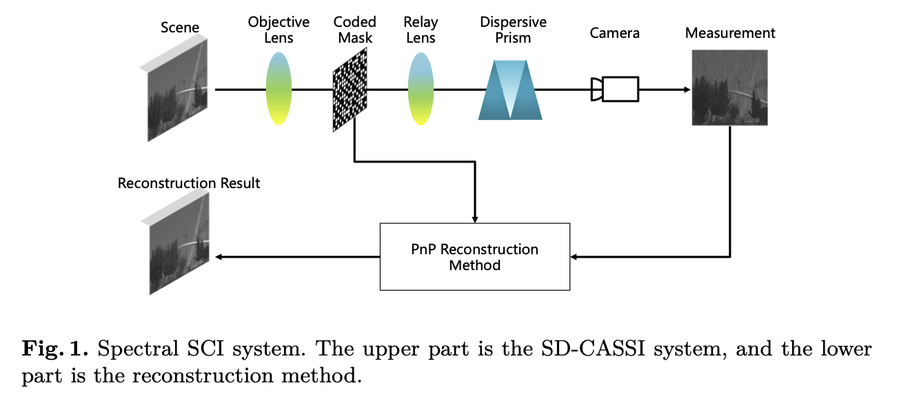
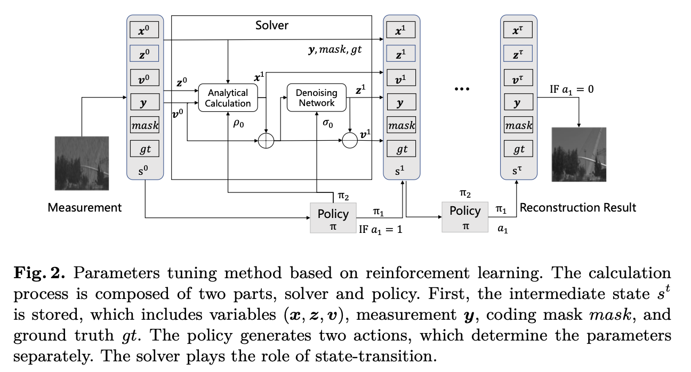
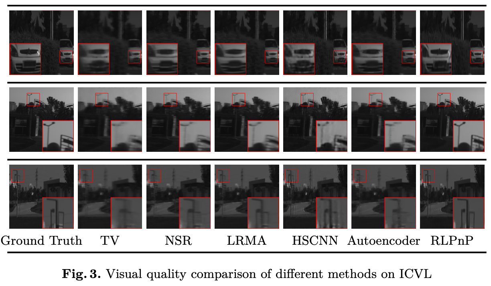
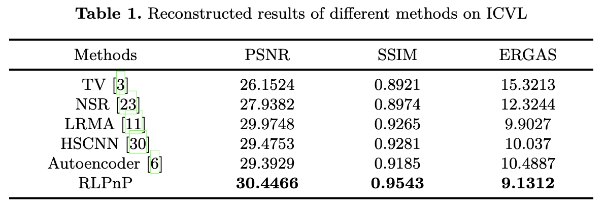
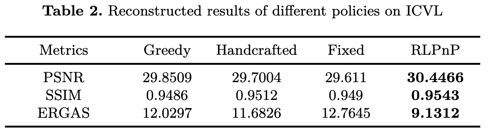

# RLPnP
This is the Python implementation of the paper "Reinforcement Learning based Plug-and-Play Method for Hyperspectral Image Reconstruction".

The paper is accepted by CAAI International Conference on Artificial Intelligence, 2022, 466-477.

## Abstract

Hyperspectral images have multi-dimensional information and play an important role in many fields. Recently, based on the com- pressed sensing (CS), spectral snapshot compressive imaging (SCI) can balance spatial and spectral resolution compared with traditional meth- ods, so it has attached more and more attention. The Plug-and-Play (PnP) framework based on spectral SCI can effectively reconstruct high- quality hyperspectral images, but there exists a serious problem of pa- rameter dependence. In this paper, we propose a PnP hyperspectral reconstruction method based on reinforcement learning (RL), where a suitable policy network through deep reinforcement learning can adap- tively tune the parameters in the PnP method to adjust the denoising strength, penalty factor of the deep denoising network, and the terminal time of iterative optimization. Compared with other model-based and learning-based methods and methods with different parameters tuning policies, the reconstruction results obtained by the proposed method have advantages in quantitative indicators and visual effects.

## Contribution

1. We introduce RL algorithm into the PnP method for hyperspectral image reconstruction, which can automatically adjust parameters and avoid experimental replication.
2. We propose a RL algorithm that combines the model-free and model-based algorithms to obtain parameters in PnP method through an efficient policy structure.
3. We demonstrate that our method outperforms competing methods, in terms of both quantitative and visual results, which shows the robustness and flexibility of our method.

## Method





## Results

### Visual results



### Quantitative results





## Requirement

- The example tasks requires `PyTorch <= 1.7`.
- The package `tfpnp` itself can be used for higher version of PyTorch.

## How to use
Download or clone the repository:

`git clone https://github.com/BITYKZhang/RLPnP`

Go into the directory "/RLPnP":

`cd RLPnP`

Configure the packages:

`pip install -e`

This implementation is based on / inspired by:

[TFPnP]: https://github.com/Vandermode/TFPnP


## Citation

If you find our work useful for your research, please consider citing the following paper

```bibtex
@inproceedings{fu2022reinforcement,
  title={Reinforcement learning based plug-and-play method for hyperspectral image reconstruction},
  author={Fu, Ying and Zhang, Yingkai},
  booktitle={CAAI International Conference on Artificial Intelligence},
  pages={466--477},
  year={2022},
  organization={Springer}
}
```

